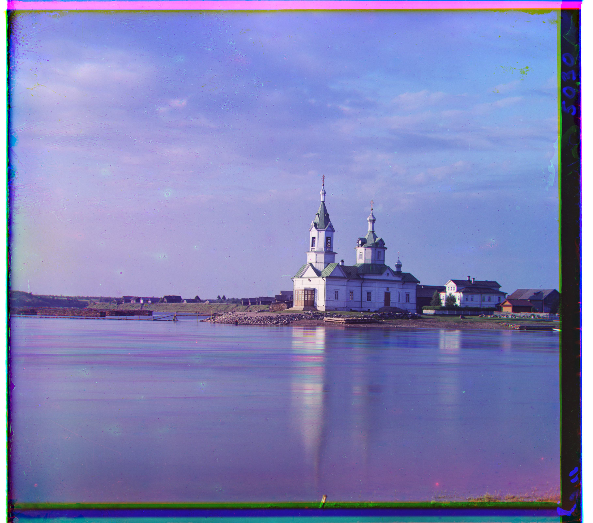

<section id="overview">
  <h2 id="overview">Overview</h2>
  

    This project colorizes grayscale glass plate negatives from the Prokudin‑Gorskii collection by aligning three channels
    (B, G, R) into a single RGB image. I use the green channel as reference and estimate integer‑pixel offsets for red and blue.
    For small JPGs I align at a single scale; for large TIFFs I use a coarse‑to‑fine image pyramid. Results and measured offsets
    are shown below.
  

  

    <figure>
      
      <figcaption>Original glass plate (TIF). Some browsers may not display TIF inline; click to download.</figcaption>
    </figure>
    <figure>
      
      <figcaption>Aligned and colorized result.</figcaption>
    </figure>
  

</section>

<section id="method">
  <h2 id="method">Method</h2>
  

    I use Normalized Cross‑Correlation (NCC) to score translations between channels. For each candidate offset (dx, dy), I compute
    correlation between zero‑mean, unit‑variance patches and select the maximum. NCC is robust to global intensity changes and
    works well on these historical plates.
  

  

    For small JPGs, I search a fixed window around the reference (G) at full resolution. For large TIFFs, I build an image pyramid
    and align from coarse to fine: estimate at the smallest scale in a small window, upsample offsets, then refine at higher
    resolutions with smaller local windows. I crop borders slightly to avoid misleading edges.
  

  

    To further reduce sensitivity to illumination and fine noise, I optionally run NCC on Sobel gradient magnitude images — this
    emphasizes structure and edges over raw intensities and helps avoid local maxima, especially on challenging images like Emir.
  

</section>

<section id="results">
  <h2 id="results">Results</h2>
  
Images are produced from <code>assets/images_out_green</code>. Captions list offsets (R: dx, dy; B: dx, dy) relative to G.

  <h3 id="small">Small images (JPG)</h3>
  <section class="grid grid-2">
    <article class="card"><figure>
      
      <figcaption>cathedral — R:(1, 7), B:(-2, -5)</figcaption>
    </figure></article>
    <article class="card"><figure>
      
      <figcaption>monastery — R:(1, 6), B:(-2, 3)</figcaption>
    </figure></article>
    <article class="card"><figure>
      
      <figcaption>tobolsk — R:(1, 4), B:(-3, -3)</figcaption>
    </figure></article>
  </section>

  <h3 id="large">Large images (TIFF)</h3>
  <section class="grid grid-2">
    <article class="card"><figure>
      
      <figcaption>church — R:(-8, 33), B:(-4, -25)</figcaption>
    </figure></article>
    <article class="card"><figure>
      
      <figcaption>emir — R:(17, 57), B:(-24, -49)</figcaption>
    </figure></article>
    <article class="card"><figure>
      
      <figcaption>harvesters — R:(-3, 65), B:(-16, -59)</figcaption>
    </figure></article>
    <article class="card"><figure>
      
      <figcaption>icon — R:(5, 48), B:(-17, -41)</figcaption>
    </figure></article>
    <article class="card"><figure>
      
      <figcaption>italil — R:(15, 38), B:(-21, -38)</figcaption>
    </figure></article>
    <article class="card"><figure>
      
      <figcaption>lastochikino — R:(-7, 78), B:(2, 2)</figcaption>
    </figure></article>
    <article class="card"><figure>
      
      <figcaption>lugano — R:(-13, 52), B:(16, -41)</figcaption>
    </figure></article>
    <article class="card"><figure>
      
      <figcaption>melons — R:(4, 96), B:(-10, -81)</figcaption>
    </figure></article>
    <article class="card"><figure>
      
      <figcaption>self_portrait — R:(8, 98), B:(-29, -78)</figcaption>
    </figure></article>
    <article class="card"><figure>
      
      <figcaption>siren — R:(-18, 47), B:(6, -49)</figcaption>
    </figure></article>
    <article class="card"><figure>
      
      <figcaption>three_generations — R:(-3, 58), B:(-13, -53)</figcaption>
    </figure></article>
  </section>

  <section>
    <h3 id="emir-note">Emir: local maxima and robust matching</h3>
    

      Emir is particularly challenging: NCC against the blue reference can get stuck in a local maximum due to low contrast and
      color differences. Two fixes worked well for me: (1) use green as the reference and crop wider borders to ignore noisy edges;
      (2) compute NCC on Sobel gradient magnitude to emphasize structure over intensity.
    

    

      <figure>
        

        <figcaption>Aligned to green, cropped borders, NCC on gradients.</figcaption>
      </figure>
      <figure>
        

        <figcaption>Blue reference can converge to a poor local maximum.</figcaption>
      </figure>
    

  </section>

</section>

<section id="discussion">
  <h2 id="discussion">Discussion</h2>
  

    Coarse‑to‑fine alignment is robust for high‑resolution plates where large displacements would be expensive to search at
    full scale. Using green as the anchor generally works well; challenging cases tend to have low‑contrast channels or strong
    brightness differences across plates. Further improvements could include gradient‑domain matching (NCC on edges) or subpixel
    refinement after integer alignment.
  

  

    Artifacts: residual color fringing near borders and moving objects; simple border cropping mitigates most.
  

</section>

<section id="assets">
  <h2 id="assets">Assets</h2>
  

    Notebook with implementation notes: <a href="./assets/RGB_Alignment_Clean.ipynb">assets/RGB_Alignment_Clean.ipynb</a>.
  

</section>
