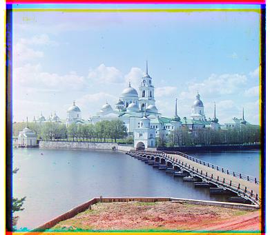
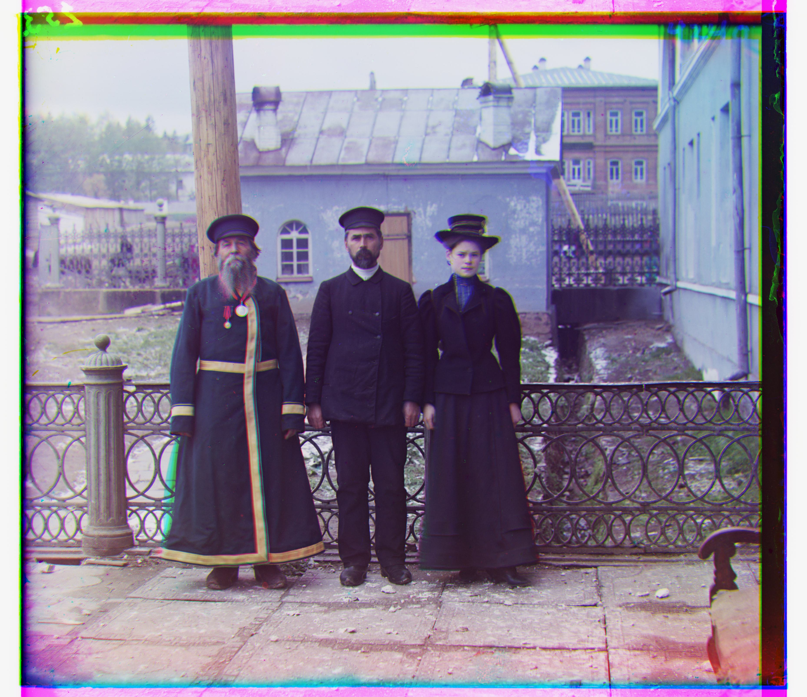

<section id="overview">
  <h2 id="overview">Overview</h2>
  

    This project colorizes grayscale glass plate negatives from the Prokudin‑Gorskii collection by aligning three channels
    (B, G, R) into a single RGB image. I use the green channel as reference and estimate integer‑pixel offsets for red and blue,
    using a single‑scale search for small JPGs and a coarse‑to‑fine image pyramid for high‑resolution TIFFs. Results and measured
    offsets are shown below.
  

</section>

<section id="method">
  <h2 id="method">Method</h2>
  

    For small images, I search a fixed window around the reference (G) for the best red/blue translation using the Sum of
    Squared Differences (SSD) over the overlapping region. For large images, I build an image pyramid and align from coarse to
    fine: estimate at the smallest scale in a small window, upsample offsets, then refine with a smaller search at the next scale.
  

  

    Practical details: I discard narrow borders to reduce edge artifacts and prefer the green channel as the reference because
    it balances texture and brightness. The final offsets are integer pixels per channel relative to green.
  

</section>

<section id="results">
  <h2 id="results">Results</h2>
  
All images below are produced from <code>assets/images_out_green</code>. Captions list method and offsets (R: dx, dy; B: dx, dy) relative to G.

  <section class="grid">
    <article class="card">
      <figure>
        
        <figcaption>cathedral — method: single; R:(1, 7), B:(-2, -5)</figcaption>
      </figure>
    </article>
    <article class="card">
      <figure>
        
        <figcaption>monastery — method: single; R:(1, 6), B:(-2, 3)</figcaption>
      </figure>
    </article>
    <article class="card">
      <figure>
        
        <figcaption>tobolsk — method: single; R:(1, 4), B:(-3, -3)</figcaption>
      </figure>
    </article>

    <article class="card">
      <figure>
        
        <figcaption>church — method: pyramid; R:(-8, 33), B:(-4, -25)</figcaption>
      </figure>
    </article>
    <article class="card">
      <figure>
        
        <figcaption>emir — method: pyramid; R:(17, 57), B:(-24, -49)</figcaption>
      </figure>
    </article>
    <article class="card">
      <figure>
        
        <figcaption>harvesters — method: pyramid; R:(-3, 65), B:(-16, -59)</figcaption>
      </figure>
    </article>

    <article class="card">
      <figure>
        
        <figcaption>icon — method: pyramid; R:(5, 48), B:(-17, -41)</figcaption>
      </figure>
    </article>
    <article class="card">
      <figure>
        
        <figcaption>italil — method: pyramid; R:(15, 38), B:(-21, -38)</figcaption>
      </figure>
    </article>
    <article class="card">
      <figure>
        
        <figcaption>lastochikino — method: pyramid; R:(-7, 78), B:(2, 2)</figcaption>
      </figure>
    </article>

    <article class="card">
      <figure>
        
        <figcaption>lugano — method: pyramid; R:(-13, 52), B:(16, -41)</figcaption>
      </figure>
    </article>
    <article class="card">
      <figure>
        
        <figcaption>melons — method: pyramid; R:(4, 96), B:(-10, -81)</figcaption>
      </figure>
    </article>
    <article class="card">
      <figure>
        
        <figcaption>self_portrait — method: pyramid; R:(8, 98), B:(-29, -78)</figcaption>
      </figure>
    </article>

    <article class="card">
      <figure>
        
        <figcaption>siren — method: pyramid; R:(-18, 47), B:(6, -49)</figcaption>
      </figure>
    </article>
    <article class="card">
      <figure>
        
        <figcaption>three_generations — method: pyramid; R:(-3, 58), B:(-13, -53)</figcaption>
      </figure>
    </article>
  </section>

  <section>
    <h3 id="emir-note">Emir: why green helps</h3>
    

      <figure>
        
        <figcaption>Aligned using green as reference</figcaption>
      </figure>
      <figure>
        
        <figcaption>Using blue reference can misalign due to low contrast</figcaption>
      </figure>
    

  </section>

</section>

<section id="discussion">
  <h2 id="discussion">Discussion</h2>
  

    Coarse‑to‑fine alignment is robust for high‑resolution plates where large displacements would be expensive to search at
    full scale. Using green as the anchor generally works well; challenging cases tend to have low‑contrast channels or strong
    brightness differences across plates. Further improvements could include gradient‑domain matching (NCC on edges) or subpixel
    refinement after integer alignment.
  

  

    Artifacts: residual color fringing near borders and moving objects; simple border cropping mitigates most.
  

</section>

<section id="assets">
  <h2 id="assets">Assets</h2>
  

    Offsets file: <a href="./assets/offsets.csv">assets/offsets.csv</a>. Notebook with implementation notes: <a href="./assets/RGB_Alignment_Clean.ipynb">assets/RGB_Alignment_Clean.ipynb</a>.
  

</section>
